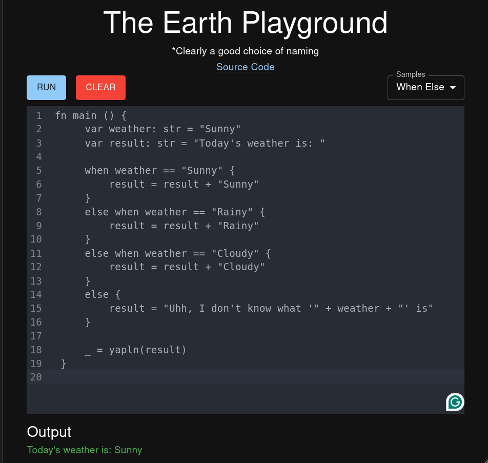

# The earth language

A toy compiler that generates JVM bytecode

## Table of contents

- [The earth language](#the-earth-language)
- [Table of contents](#table-of-contents)
- [Testing the compiler](#testing-the-compiler)
    - [If you don't want to clone the repository](#if-you-dont-want-to-clone-the-repository)
    - [(Docker Compose) If you want to clone the repository](#docker-compose-if-you-want-to-clone-the-repository)
    - [Or individually](#or-individually)

## Testing the compiler

The easiest way to test the compiler is with the playground using docker.
This is what it looks like:



---

### If you don't want to clone the repository

Run the server image with:

```bash
docker run --name playground-server \
  -d \
  -p 8080:8080 \
  ifesunmola/playground-server
```

This creates a container named `playground-server`. The `-d` flag runs the
container in detached mode. And the server will be available at
`http://localhost:8080`. Open a browser and go to
`http://localhost:8080/samples` to verify if the server is running.

And, run the client image with:

```bash
docker run --name playground-client \
  -d \
  -p 5173:80 \
  ifesunmola/playground-client
```

Same command, but this time the container is named `playground-client` and it
runs on port 5173. Open a browser and go to `http://localhost:5173` to see the
playground

### (Docker Compose) If you want to clone the repository

Clone and run:

```bash
docker compose up
```

### Or individually

Using the docker image (or Dockerfile) would be the easiest way to run some
code. But if you want to do it from scratch, steps for running each part of the
project are located in the README.md in each directory:

1. [Compiler](compiler) - Contains the actual compiler and runtime
2. [web-client](web-client) - Contains the frontend for the playground
3. [web-server](web-server) - Contains the backend for the playground