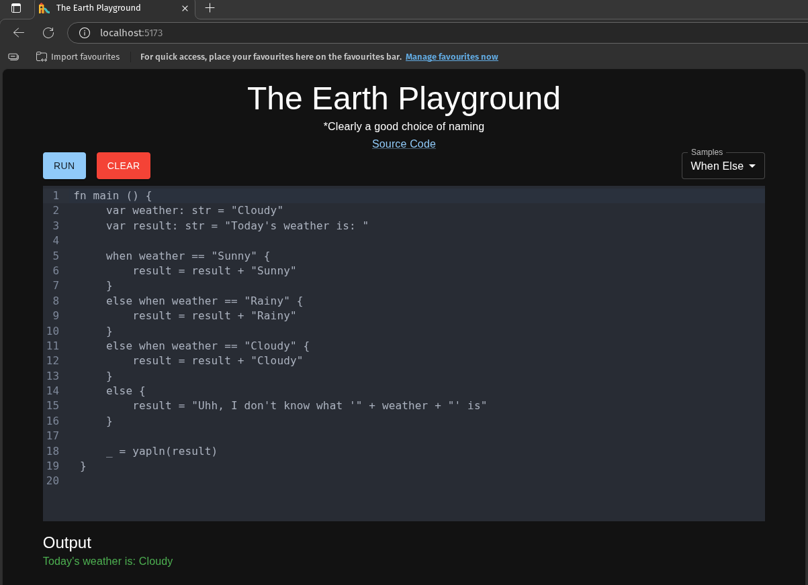

# The earth language

A toy compiler that generates JVM bytecode

## Table of contents

- [Downloading from the releases page](#downloading-from-the-releases-page)
- [Using the (Docker) playground](#using-the-docker-playground)
    - [If you don't want to clone the repository (Docker run)](#if-you-dont-want-to-clone-the-repository-docker-run)
    - [If you want to clone the repository (Docker Compose)](#if-you-want-to-clone-the-repository-docker-compose)
- [Run each part of the project individually](#run-each-part-of-the-project-individually)

## Downloading from the releases page

1. Download the corresponding release for your platform from the releases page
   at: https://github.com/IfeSunmola/earth-lang/releases
2. Extract the archive
3. cd into the extracted directory and run a sample code:
    ```bash
    ./earth samples/fizz_buzz.earth
    ``` 

## Using the (Docker) playground

I'm not saying you should be skeptical, but do you really wanna run a binary
built by some random person on your PC? No? Good.

This is what the playground looks like:



---

### If you don't want to clone the repository (Docker run)

Run the server image with:

```bash
docker run --name playground-server \
  -d \
  -p 8080:8080 \
  ifesunmola/playground-server
```

This creates a container named `playground-server`. The `-d` flag runs the
container in detached mode. And the server will be available at
`http://localhost:8080`. Open a browser and go to
`http://localhost:8080/samples` to verify if the server is running.

And, run the client image with:

```bash
docker run --name playground-client \
  -d \
  -p 5173:80 \
  ifesunmola/playground-client
```

Same command, but this time the container is named `playground-client` and it
runs on port 5173. Open a browser and go to `http://localhost:5173` to see the
playground

### If you want to clone the repository (Docker Compose)

Clone and run:

```bash
docker compose up
```

## Run each part of the project individually

Using the docker image (or Dockerfile) would be the easiest way to run some
code. But if you want to do it from scratch, steps for running each part of the
project are located in the README.md in each directory:

1. [Compiler](compiler) - Contains the actual compiler and runtime
2. [web-client](web-client) - Contains the frontend for the playground
3. [web-server](web-server) - Contains the backend for the playground